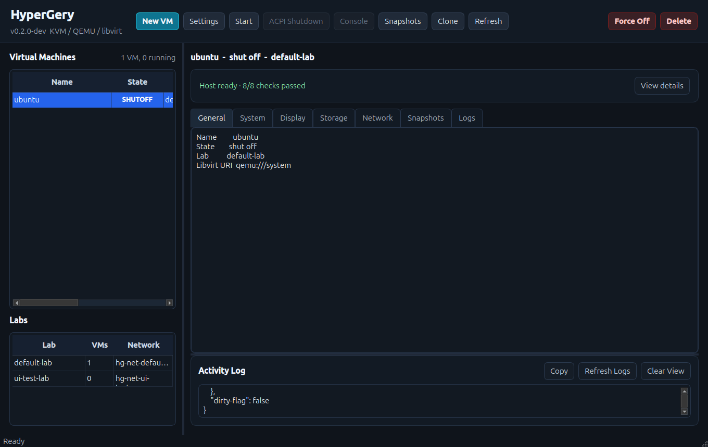

# HyperGery

**A real Ubuntu desktop VM manager powered by KVM/QEMU/libvirt.**


HyperGery is a real desktop virtual machine manager for Ubuntu, functionally inspired by VirtualBox workflows but using KVM/QEMU/libvirt as its real backend through `virsh`, `qemu-img`, and `virt-viewer` or `remote-viewer`.

HyperGery v0.5.0 adds Lab Topology visualisation, an improved planned VM editor, ISO reuse in the instantiation wizard, a resource overview panel, and new CLI commands for template update and lab instantiation.

HyperGery v0.6.0 development is focused on NAS Live Migration: a NAS-backed control plane, host agents, host discovery, VM package export/import, migration preflight, remote import orchestration, and a UI action named **Live Migration**. The implementation is intentionally conservative: when a true live RAM/disk migration is not safe, HyperGery performs a NAS Clone Migration strategy and keeps the source VM untouched.

Current v0.6.0 status: tests, Docker Hub, Hub/Agent smoke, UI smoke, local NAS Clone Migration E2E, and a real two-physical-host NAS Clone Migration smoke have passed on `develop`. v0.6.0 remains an RC until the release is intentionally cut; no tag, release, or `main` merge has been created.

## Screenshots



## Features

### VM Management (v0.1.0+)

- Real KVM/QEMU/libvirt backend via `virsh` and `qemu-img`.
- VM creation from a local ISO with qcow2 disks.
- NAT and isolated libvirt networks per lab.
- SPICE/VNC console through `virt-viewer` or `remote-viewer`.
- Start, ACPI shutdown, and force off.
- Snapshots: create, list, revert, delete.
- Clone stopped VMs.
- Safe delete with disk confirmation.
- Preflight checks for KVM, libvirt, QEMU tools, viewer tools, and user groups.

### Lab Manager (v0.3.0)

- Labs are isolated virtual environments with their own libvirt network, bridge, and subnet.
- Create, rename, delete, duplicate, export, and import labs via the Qt UI or CLI.
- Each lab gets a deterministic `hg-net-<lab-id>` network and `hgbr<hash>` bridge.
- Subnets are allocated without collisions against existing labs and `192.168.122.0/24`.
- VM list can be filtered by lab (All VMs / Selected Lab).
- Lab manifests are JSON files at `~/.local/share/hypergery/labs/<lab-id>/lab.json`.
- `templates_used` field tracks which templates contributed to the lab.

### Templates Manager (v0.3.0+)

- **VM Templates** describe reusable VM resource profiles (OS type, RAM, vCPUs, disk, network, display).
- **Lab Templates** describe reusable lab structures with a list of planned VMs.
- Create, delete, export, import, and **edit** templates via the Qt UI or CLI.
- **Create VM from Template**: opens the wizard with resource fields pre-filled; user chooses VM name, ISO, and lab.
- **Create Lab from Template** (v0.4.0): 3-page wizard — Lab Identity, ISO Mapping (per-VM ISO browse), and Review. Creates the lab and all planned VMs in a background worker with transactional rollback.
- Template IDs are normalized slugs: 3-64 lowercase alphanumeric characters with dashes.
- Templates stored at `~/.local/share/hypergery/templates/vm/` and `.../templates/lab/`.

### Lab Automation (v0.4.0)

- Planned VMs inside Lab Templates now carry `iso_required`, `role`, and `notes` fields.
- VM Template defaults are merged automatically when a planned VM references a `template_id`.
- `dry_run` mode validates the full instantiation plan without creating anything.
- Partial failure triggers automatic rollback of created VMs and the lab manifest.
- **Edit VM/Lab Template**: update any field in place without delete + re-create.
- **Add/Remove Planned VMs** from the Edit Lab Template dialog.
- **Duplicate Lab with VM Cloning**: Clone VMs checkbox enabled when VMs are present; clones qcow2 disks via `qemu-img convert`; requires all VMs shut off.

### Lab Topology (v0.5.0)

- **Visual topology tab** in the Lab Details panel: QPainter canvas showing the lab network node and VM nodes colour-coded by state.
- State colours: running = green, shut off = grey, paused = amber, not created = slate blue.
- VMs only in the lab manifest (not yet created in libvirt) shown as "not created".
- Click a VM node to select it in the main VM list.
- `build_lab_topology()` and `topology_to_json()` available for scripting.

### CLI (v0.5.0)

```bash
# Update template fields in place
python -m hypergery_ubuntu.cli template update vm ubuntu-base --set ram_mib=8192 --set notes="Updated"
python -m hypergery_ubuntu.cli template update lab asr-lab --set notes="v2"

# Print lab topology as JSON
python -m hypergery_ubuntu.cli lab-topology asr-lab

# Instantiate a lab template (dry-run or real)
python -m hypergery_ubuntu.cli lab-instantiate asr-lab "ASR Instance" \
  --iso server=/path/to/ubuntu.iso --iso client=/path/to/ubuntu.iso --dry-run
```

### Resource Overview (v0.5.0)

- **Resources…** button in the toolbar opens a read-only overview of all HyperGery-managed VMs, labs, VM templates, and lab templates.
- Nothing is deleted automatically — the dialog is a safe audit view.

### HyperGery Console Window (v0.6.0)

- **Console** opens a separate HyperGery Console window. Running VNC-backed VMs connect automatically.
- **External Console** keeps the existing `virt-viewer` / `remote-viewer` workflow for SPICE and fallback.
- VNC displays are generated by libvirt with `listen="127.0.0.1"` and `autoport="yes"`; HyperGery does not expose VNC on the network by default.
- **Scale to Fit** is enabled by default, keeps aspect ratio, and centers the framebuffer in the available window area.
- Click inside a connected VNC console window to capture input. Press **Right Ctrl** to release input.
- Closing or disconnecting the console window does not stop the VM; use ACPI Shutdown or Force Off to stop it.
- SPICE remains supported for external viewing. The HyperGery Console window shows a clear SPICE card with **Open External Viewer** instead of a blank screen.
- To view the console inside HyperGery, create the VM with Display `vnc` or switch an existing SPICE VM to VNC while it is shut off.

### HyperGery Hub Docker (v0.6.0)

- HyperGery Hub is the NAS control plane for Remote Hosts, agent heartbeats, VM inventory, command queues, migration state, and events.
- Docker deployment lives in `docker/` and starts with `cd docker && docker compose up -d`.
- On the NAS/QNAP, use `HYPERGERY_NAS_ROOT=/share/CACHEDEV2_DATA/Gerard/hypergery`.
- On the Ubuntu VM/app, use `HYPERGERY_HUB_URL=http://192.168.1.150:8765`.
- The Hub DB is stored in the Docker volume `hypergery-hub-data`; migration packages stay under the NAS data folder.
- The container has a `/health` Docker healthcheck.
- App-level settings live in `~/.config/hypergery/config.json`; environment variables remain overrides.
- `python -m hypergery_ubuntu.cli doctor` checks Python, KVM, libvirt, Hub, NAS staging, Docker Compose, and Hub VM inventory without changing the system.
- See [docs/HYPERGERY_HUB.md](docs/HYPERGERY_HUB.md), [docs/NAS_DEPLOYMENT.md](docs/NAS_DEPLOYMENT.md), and [docs/QUICK_START_V06.md](docs/QUICK_START_V06.md).

### NAS Live Migration (v0.6.0)

- HyperGery Hub / NAS Control Plane for host discovery, VM inventory, command queueing, events, and migration status.
- HyperGery Agent on each participating host with safe command allowlist only.
- NAS staging directory for migration packages.
- VM package export/import for domain XML, qcow2 disks, attached ISO when requested, lab/network/template metadata, checksums, and migration logs.
- Migration preflight checks for source VM state, disk/ISO availability, staging path, local name conflicts, host readiness, and running-VM safety.
- Remote Hosts UI panel reads real hosts from the Hub and shows online/offline state, last seen, RAM/disk, KVM/libvirt readiness, and active VMs.
- Remote Hosts also shows Hub URL, Hub status, last check, online host count, VM record count, and NAS staging writability.
- **Live Migration** dialog lists real online target hosts, blocks offline/unready targets, runs local preflight, creates the source package in NAS staging, queues `import_vm_package` on the target host, and records migration status for polling.
- Development CLI: hub, registry compatibility alias, agent, host, doctor, and migrate commands.
- Real two-host smoke validated `hg-source` -> `hg-target` through Hub `http://192.168.1.44:8765`, NAS package `hg-v06-2host-source-f67154f7803b`, source preservation, target UUID/MAC regeneration, target boot to `running`, target cleanup, and retained NAS package.

v0.6.0 must not delete the source VM or original disks. Running VM copy is blocked unless HyperGery can use a real safe libvirt/QEMU strategy; otherwise users must choose paused/offline NAS Clone Migration.

Current development CLI:

```bash
python -m hypergery_ubuntu.cli hub serve --host 127.0.0.1 --port 8765
python -m hypergery_ubuntu.cli hub health
python -m hypergery_ubuntu.cli agent config show
python -m hypergery_ubuntu.cli agent once
python -m hypergery_ubuntu.cli host list
python -m hypergery_ubuntu.cli host test <host_id>
python -m hypergery_ubuntu.cli doctor

# Safe offline package workflow
python -m hypergery_ubuntu.cli migrate preflight <vm_name> --target-vm-name <target_name> --nas-path /mnt/hypergery-nas
python -m hypergery_ubuntu.cli migrate package <vm_name> /mnt/hypergery-nas --target-vm-name <target_name>
python -m hypergery_ubuntu.cli migrate validate-package /mnt/hypergery-nas/migrations/<migration_id>
python -m hypergery_ubuntu.cli migrate import /mnt/hypergery-nas/migrations/<migration_id> --target-vm-name <target_name>
python -m hypergery_ubuntu.cli migrate list --path /mnt/hypergery-nas

# Remote Hub/agent orchestration
python -m hypergery_ubuntu.cli migrate remote <vm_name> \
  --nas-path /mnt/hypergery-nas \
  --source-host-id source-host \
  --target-host-id target-host \
  --target-vm-name <target_name>
python -m hypergery_ubuntu.cli migrate status --migration-id <migration_id>
```

See [docs/NAS_LIVE_MIGRATION.md](docs/NAS_LIVE_MIGRATION.md) for the package layout and safety model.

### Not yet implemented

- True live RAM migration with custom dirty-page transfer.
- HG-MEMDIFF or any custom RAM dirty-page transfer protocol.
- Integrated SPICE renderer.
- Lab topology zoom/pan and PNG/SVG export.
- VM role badges on topology nodes.
- Per-VM progress during lab instantiation.
- Android Hub, IsardVDI, P2P, GPU shadowing.

## Requirements

Target platforms:

- Ubuntu 22.04 LTS
- Ubuntu 24.04 LTS
- Compatible Ubuntu-based systems with KVM/QEMU/libvirt

Required system packages:

```bash
sudo apt install qemu-system-x86 qemu-utils \
  libvirt-daemon-system libvirt-clients \
  libvirt-daemon-driver-qemu libvirt-daemon-config-network \
  virt-viewer ovmf dnsmasq-base \
  python3-pip python3-venv python3-dev python3-tk \
  libxcb-cursor0 libxcb-icccm4 libxcb-image0 \
  libxcb-keysyms1 libxcb-render-util0 libxkbcommon-x11-0
```

Python dependency: `PySide6` (installed in the virtualenv, see below).

The current user must belong to the `kvm` and `libvirt` groups.

## Installation

### First run on a fresh Ubuntu laptop

For a new Ubuntu/Linux laptop, the launcher can check and prepare most of the host automatically:

```bash
git clone https://github.com/Elgeryy1/hypergery.git
cd hypergery
./scripts/dev-run.sh
```

On first run, `dev-run.sh` checks QEMU/libvirt tools, `/dev/kvm`, libvirt services, `kvm`/`libvirt` group membership, Python venv state, and PySide6. If something is missing, it prints a summary and asks:

```text
Continue? [y/N]
```

If accepted, sudo or pkexec may request your password. The script installs only the Ubuntu packages HyperGery needs, enables libvirt services where available, creates `~/.venvs/hypergery` with `python3 -m venv --copies`, installs HyperGery editable into that venv, runs preflight, and opens the Qt app.

If group membership is changed, log out and back in before KVM/libvirt permissions fully apply.

Useful modes:

```bash
./scripts/dev-run.sh --check-only  # report only
./scripts/dev-run.sh --no-install  # fail instead of installing
./scripts/dev-run.sh --install     # install/fix without interactive prompt except sudo/pkexec
./scripts/dev-run.sh --legacy-tk   # launch legacy Tk fallback
```

Manual system dependency install is still available:

```bash
./scripts/install-ubuntu-deps.sh
```

Manual Python setup:

```bash
python3 -m venv --copies ~/.venvs/hypergery
source ~/.venvs/hypergery/bin/activate
python -m pip install --upgrade pip
python -m pip install -e ./hypergery-ubuntu
```

HyperGery intentionally uses `~/.venvs/hypergery` for the launcher path so a repo cloned onto a NAS or filesystem with unreliable symlinks does not get a local `.venv`.

If the repository lives on a local filesystem and you want a manual editable install with your current Python:

```bash
cd hypergery-ubuntu && python3 -m pip install -e .
```

Optional desktop launcher:

```bash
./scripts/install-desktop-launcher.sh
```

## Run

Run preflight:

```bash
./scripts/preflight.sh
```

Run the Qt desktop app:

```bash
./scripts/dev-run.sh
# or: python -m hypergery_ubuntu
```

Run the CLI:

```bash
python3 -m hypergery_ubuntu.cli preflight
python3 -m hypergery_ubuntu.cli lab list
python3 -m hypergery_ubuntu.cli template list vm
python3 -m hypergery_ubuntu.cli create-vm --name my-vm --iso /path/to/ubuntu.iso \
  --ram-mib 4096 --vcpus 2 --disk-gb 40
```

Run the acceptance script with a real ISO:

```bash
./scripts/acceptance-ubuntu.sh --iso /path/to/ubuntu-or-debian.iso --name hg-acceptance-ubuntu-test
```

## Tests

System Python (no PySide6 — Qt tests are skipped cleanly):

```bash
cd hypergery-ubuntu && python3 -m unittest discover -s tests
```

Full suite inside the venv (all 201 tests pass including Qt tests):

```bash
cd hypergery-ubuntu && ~/.venvs/hypergery/bin/python -m unittest discover -s tests
```

## Safety

HyperGery runtime data is kept outside the repository:

- VM disks: `~/.local/share/hypergery/vms/`
- Lab manifests: `~/.local/share/hypergery/labs/`
- VM templates: `~/.local/share/hypergery/templates/vm/`
- Lab templates: `~/.local/share/hypergery/templates/lab/`
- Logs: `~/.local/state/hypergery/logs/`

The repository `.gitignore` excludes ISOs, virtual disks, logs, local runtime folders, `.env` files, credentials, keys, and certificates. Do not commit private ISOs, VM disks, credentials, or student data.

## Roadmap

- v0.3.0 — Lab Manager + Templates Manager ✓
- v0.4.0 — Lab Automation (instantiation wizard, rollback, template editing, VM clone in duplicate) ✓
- v0.5.0 — Lab Topology view, planned VM editor, ISO reuse, resource overview, CLI update/instantiate ✓
- v0.6.0 — NAS Live Migration: registry, agents, host discovery, NAS staging, migration package export/import, UI action, CLI helpers
- v0.7.0 — topology export/polish, zoom/pan, role badges, additional UX refinement
- v1.0.0 — stable classroom-ready release

## License

MIT. See [LICENSE](LICENSE).
